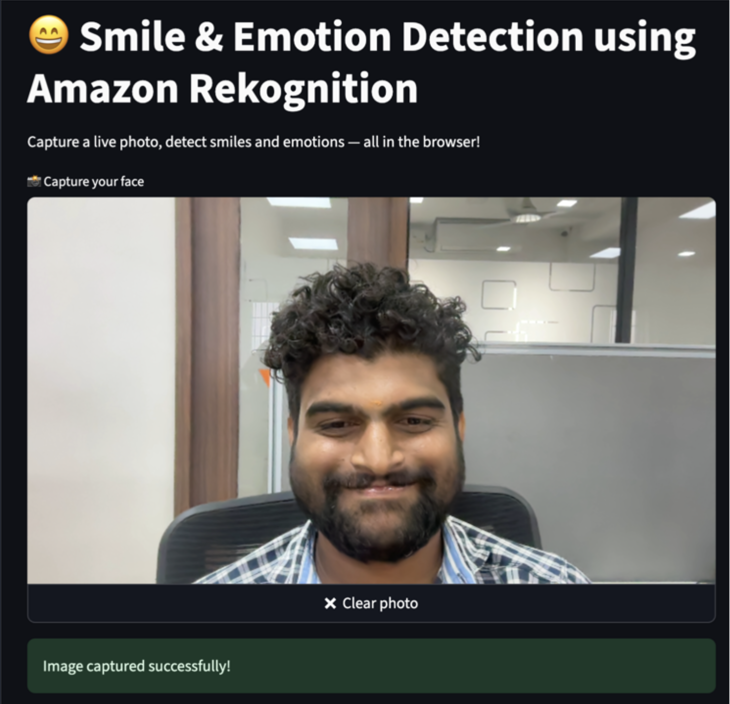
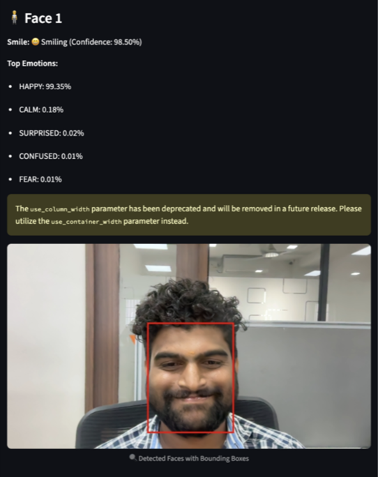
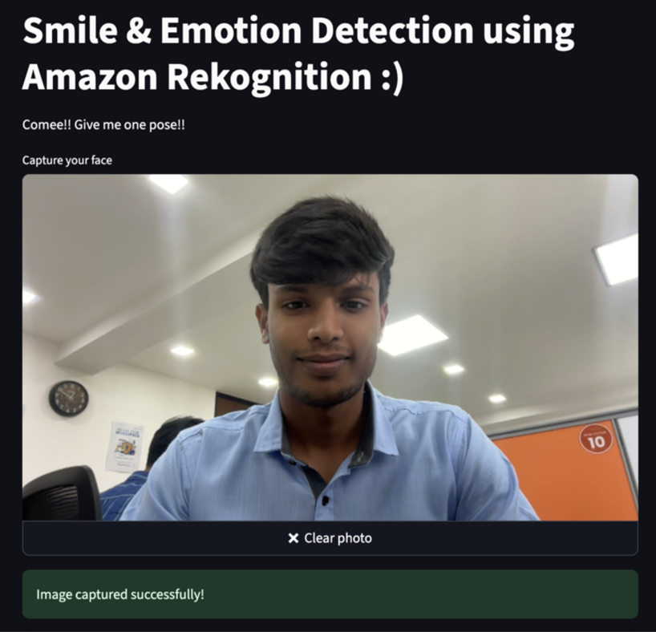
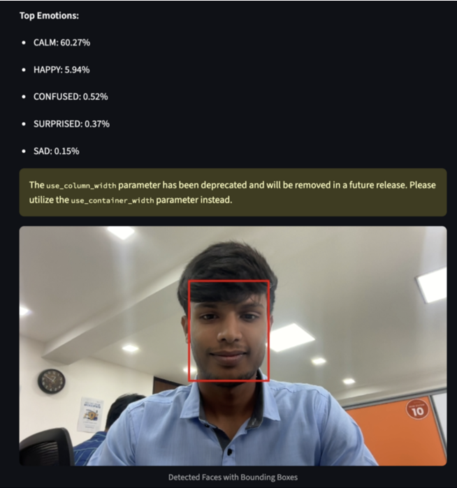

# 😊 Smile & Emotion Detection Web App  

A fun and interactive **AI-powered web application** that detects **smiles and emotions** from your webcam using **Amazon Rekognition**.  

This project was built as part of **Whizlabs AI Practitioner Labs**.  

👉 **[Check out the full project here!](https://www.whizlabs.com/labs/build-a-real-time-smile-emotion-detection-web-app-using-amazon-rekognition)**  

---

## ✨ What this app does  
- 🎥 Capture an image using your webcam  
- ☁️ Store the image securely in **Amazon S3**  
- 🤖 Analyze faces, smiles, and emotions with **AWS Rekognition**  
- 🖼️ Display results with bounding boxes and confidence scores  

---

## 🛠️ Problem I Faced  
Getting **webcam access on HTTP** was a major hurdle ⚡.  
Modern browsers block camera permissions unless the app runs on **HTTPS**.  
To solve this, I had to run Chrome in a special testing mode.  

---

## 🌟 Why this Project is Unique  
- Combines **real-time user interaction** with **cloud AI services**  
- Brings together **Streamlit, AWS S3, Rekognition, Docker, ECS, and ALB** into one workflow  
- Not just a simple AI demo — but a **cloud-deployed, production-like app**  

---

## 🚀 Future Enhancements  
- 🔐 Add secure **HTTPS** with SSL certificate  
- 📊 Store results in **DynamoDB** for history tracking  
- 👥 Support **multi-user sessions**  
- 🌐 Deploy globally with **CDN integration** for faster response  

---

## 📚 What I Learned  
- Setting up **Amazon S3** buckets and permissions  
- Using **Amazon Rekognition** for emotion & smile detection  
- Containerizing apps with **Docker**  
- Deploying services on **AWS ECS Fargate** with **Load Balancers**  
- Solving real-world browser security restrictions  

---

## 📸 Sneak Peek 

### Capturing Image 1 :
  

### Smile Detection Result :
  

### Capturing Image 2 :
  

### Smile Detection Result :
  

---

## 🤝 Credits  
- Thanks to **Whizlabs** for providing the lab environment  
- AWS Services for powering the backend intelligence  
- Inspiration from **AI + Cloud projects** community  

---

## 🌐 GitHub Repository  
🔗 [zehra-stark/smile-emotion-detection](https://github.com/zehra-stark/smile-emotion-detection)  

---

## 👩‍💻 Author  
Made with 💡 and ☕ by **Nivetha Velmurugan**  

---

> *“When do you think people die? When they are shot with a bullet? No!  
> When they eat a soup made from a poisonous mushroom? No!  
> It’s when they are forgotten.”* – Dr. Hiriluk  

This project is my small step to make sure **my learnings are never forgotten**,  
just like the will of D in One Piece 🌊🏴‍☠️.  
